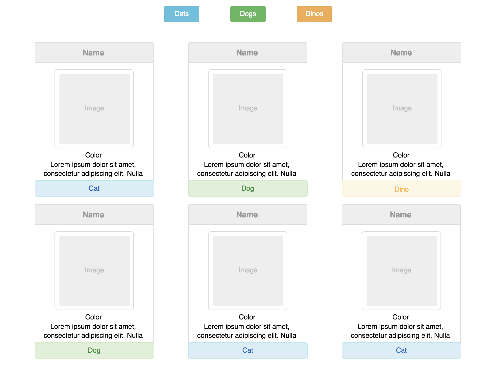

## Requirements - Loops

- As a user, I want to see a listing of all available pets. Each pet should have a card that has all this data:
```javascript
{
  id: number
  image: string
  name: string
  color: string
  specialSkill: string
  typeOfPet: string
}
```

## Requirement - Part 1: HTML Representation of Data
- Using the data provided in `main.js`, take a look at the format and update the data if needed based on the data example above.
- Loop through each object and render each item to the DOM


## Requirement - Part 2: Event Listeners

- As a user, I want to see 3 category(type) buttons rendered at the top of the page. Each should be a different color. These can be hard-coded in the HTML.
- I want to be able to click one of the 3 buttons, then only the cards that are in the category(type) should show.
- There should be some way for the user to unfilter the results (ie All Pets button).



## Requirement - Part 3: Create Pets
- Create a form that allows a user to add pets with a submit button
- When the submit button is pressed, the pet is added to the array and the DOM rerenders adding the new pet on the DOM.

## Requirement - Part 4: Delete Pets
- Each card should have a delete button that when clicked removes the pet from the array and re-renders the DOM
